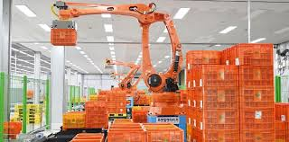

# 로봇 팔을 통한 과일 선별 과정 자동화

## 프로젝트 개요

본 프로젝트는 ROS2 기반 협동 로봇을 활용하여 과일의 신선도 및 크기를 판별하고, 선별된 과일을 박스에 포장하는 자동화 시스템을 개발하는 것을 목표로 한다. 로봇은 정밀한 움직임을 통해 과일을 선별하고 포장하는 과정을 담당한다.

## 프로젝트 목표

- 로봇 손의 정밀한 움직임을 활용하여 감을 선별하고 포장하는 기능 개발
- 과일의 신선도와 크기를 판별하는 자동화 시스템 구현
- 과일 인식 기술을 개발하여 선별 기준 설정

## 방법론

- ROS2를 이용한 로봇 프로그래밍
- 컴퓨터 비전 기술을 이용한 감 인식 개발
- 정밀 움직임을 위한 센서 통합
- 사용자 관리 및 모니터링을 위한 애플리케이션 개발

## 필요 자원

- 하드웨어: 두산 협동 로봇, 고해상도 카메라, 다양한 센서
- 소프트웨어: ROS2, OpenCV 컴퓨터 비전 라이브러리

## 프로젝트 참여자

- 학번: 202121010
- 이름: 양필성
- 이메일: lal4995@gmail.com

## 예상 예산

|품목  | 가격(원)|
| ---- | ----- |
| 웹캠 | 64,800 |
| **총 예산** | **64,800** |

## 예상 일정 (총 기간: 8주)

| 주차   | 활동       |
| ------ | ------------------ |
| 주 1-2 | 프로젝트 계획 및 초기 설계   |
| 주 3-4 | 로봇 프로그래밍 및 시뮬레이션  |
| 주 5-6 | 과일 선별 알고리즘 구현 및 파이프라인 구축 |
| 주 7   | 테스트 및 피드백  |
| 주 8   | 최종 발표, 프로젝트 마무리 및 문서화  |

## 위험 관리

기술적 실패 및 일정 지연에 대비하여 소프트웨어 및 하드웨어에 대한 충분한 이해와 테스트를 통해 위험 최소화

