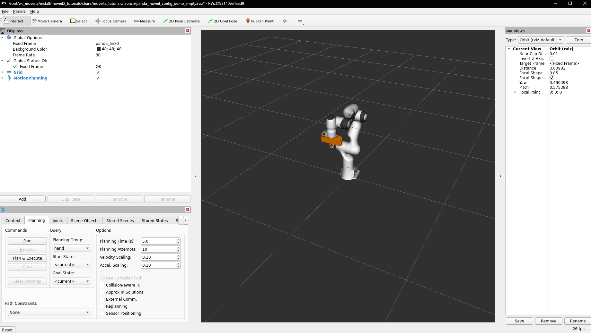

### 1. Dockerfile 작성

현재 작업 디렉토리에서 `Dockerfile`을 작성한다.
예시(/home/qhddybuntu/workspace/projects/ros2-container)

```Dockerfile
# Use official ROS 2 Humble base image
FROM osrf/ros:humble-desktop

# Set locale
RUN apt update && apt install -y locales \
  && locale-gen en_US en_US.UTF-8 \
  && update-locale LC_ALL=en_US.UTF-8 LANG=en_US.UTF-8 \
  && export LANG=en_US.UTF-8

# Remove existing ROS 2 sources to avoid conflicts
RUN rm -f /etc/apt/sources.list.d/ros2-latest.list

# Add ROS 2 sources
RUN apt update && apt install -y software-properties-common curl \
  && curl -sSL https://raw.githubusercontent.com/ros/rosdistro/master/ros.key -o /usr/share/keyrings/ros-archive-keyring.gpg \
  && sh -c 'echo "deb [arch=$(dpkg --print-architecture) signed-by=/usr/share/keyrings/ros-archive-keyring.gpg] http://packages.ros.org/ros2/ubuntu $(. /etc/os-release && echo $UBUNTU_CODENAME) main" > /etc/apt/sources.list.d/ros2.list'

# Update and install necessary packages
RUN apt update && apt upgrade -y \
  && apt install -y ros-humble-turtlesim \
  && apt install -y ~nros-humble-rqt* \
  && apt install -y ros-dev-tools

# Setup colcon mixin
RUN if ! colcon mixin list | grep -q 'default'; then colcon mixin add default https://raw.githubusercontent.com/colcon/colcon-mixin-repository/master/index.yaml; fi \
  && colcon mixin update default

# Create workspace and clone MoveIt 2 source
RUN mkdir -p ~/ws_moveit2/src \
  && cd ~/ws_moveit2/src \
  && git clone https://github.com/ros-planning/moveit2_tutorials -b humble \
  && vcs import < moveit2_tutorials/moveit2_tutorials.repos

# Install dependencies
RUN cd ~/ws_moveit2 \
  && rosdep install -r --from-paths src --ignore-src --rosdistro humble -y

# Build dependencies first
RUN /bin/bash -c "source /opt/ros/humble/setup.bash && cd ~/ws_moveit2 && colcon build --mixin release --packages-select moveit_common moveit_resources_panda_description moveit_resources_pr2_description srdfdom moveit_resources_panda_moveit_config --parallel-workers 1"

# Build MoveIt 2 core
RUN /bin/bash -c "source /opt/ros/humble/setup.bash && cd ~/ws_moveit2 && colcon build --mixin release --packages-select moveit_core --parallel-workers 1"

# Build remaining packages
RUN /bin/bash -c "source /opt/ros/humble/setup.bash && cd ~/ws_moveit2 && colcon build --mixin release --packages-skip moveit_common moveit_resources_panda_description moveit_resources_pr2_description srdfdom moveit_resources_panda_moveit_config --parallel-workers 1"

# Source the ROS 2 setup script and the workspace setup script
RUN echo "source /opt/ros/humble/setup.bash" >> ~/.bashrc \
  && echo "source ~/ws_moveit2/install/setup.bash" >> ~/.bashrc

# Set the entrypoint
ENTRYPOINT ["/bin/bash"]
```

### 2. Docker 이미지 빌드

1. 터미널을 열고 Dockerfile이 있는 디렉토리로 이동한다.
   ```bash
   cd /home/qhddybuntu/workspace/projects/ros2-container
   ```

2. Docker 이미지를 빌드한다.
   ```bash
   docker build -t moveit2-tutorials .
   ```

### 3. Docker 컨테이너 실행

1. 호스트 시스템에서 `x11-xserver-utils` 패키지를 설치합니다.
   ```bash
   sudo apt-get update
   sudo apt-get install x11-xserver-utils
   ```

2. X 서버를 Docker 컨테이너와 공유하도록 설정한다.
   ```bash
   xhost +local:docker
   ```

3. Docker 컨테이너를 실행한다.
   ```bash
   docker run -it --rm --env="DISPLAY" --volume="/tmp/.X11-unix:/tmp/.X11-unix:rw" moveit2-tutorials
   ```

### 4. 컨테이너 내에서 MoveIt 2 데모 실행

1. 컨테이너 내부에서 `xauth`를 설치한다.
   ```bash
   apt-get update && apt-get install -y xauth
   ```

2. 필요한 환경 변수를 설정한다.
   ```bash
   export DISPLAY=${DISPLAY}
   ```

3. ROS 2와 MoveIt 2 환경을 소싱한다.
   ```bash
   source /opt/ros/humble/setup.bash
   source ~/ws_moveit2/install/setup.bash
   ```

4. MoveIt 2 데모를 실행한다.
   ```bash
   ros2 launch moveit2_tutorials demo.launch.py
   ```
   or
   ```bash
   ros2 launch moveit2_tutorials demo.launch.py rviz_config:=panda_moveit_config_demo_empty.rviz
   ```


